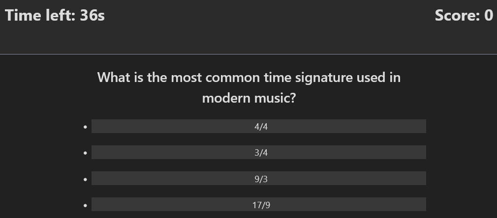
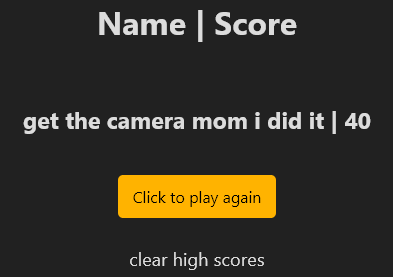

# JavaScript Powered Quiz

---
## Description

This project is a quiz powered almost entirely by JavaScript. Changing the HTML document, populating the page with questions, transitioning between questions, and localStorage all dealt with by the js.

I wanted to learn more about how to utilize click events to trigger things happening in the webapp, and this was a great way to do so. I also learned a lot about manipulating and changing variables based on using a timer method.

---
## Installation

N/A

---
## Usage

Project Repository: [Click me (you're already here)](https://github.com/t-willis/quiz-js-powered)

Deployed Application: [Click me](https://t-willis.github.io/quiz-js-powered/)

---

To begin the quiz all you have to do is click the start button as pictured above.

---

During the quiz your remaining time is listed in the upper left and your score on the upper right. All you hav to do is hover your mouse over one of the answers and click to choose which answer you think is correct.

---

Once you've answered all of the questions or the timer has reached 0 you will be prompted to enter your name for the leaderboard. Type your name in and click the submit button to move to the leaderboard.

---

The name you input will be displayed alongside your score for the quiz. If you wish to clear the leaderboard database all you have to do is click on the 'clear high scores' text and it will be removed from local storage.

---

## Credits

[simplecss](https://www.simplecss.org) - Pre-made css

[gamedevacademy.org](https://gamedevacademy.org/javascript-quiz-tutorial/) - tutorial for replacing .textContent with objects in an array at a specific index point